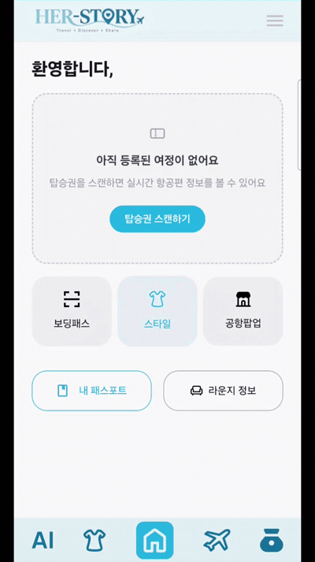

# herstory-frontend

herstory의 공항 여정(출국 전 준비 → 공항 내 서비스 → 귀국 후)을 안내하는 Next.js 웹 애플리케이션입니다.

<p align="center">
  
</p>

<p align="center">
  <sub>탑승권을 스캔해 여정을 등록하는 흐름. 저장된 여정 ID가 서버에서 사라진 경우에도<br />
  화면이 멈추지 않고 이 첫 화면(탑승권 스캔 안내)으로 복귀합니다.</sub>
</p>

## 기술 스택

- [Next.js 16](https://nextjs.org/) (App Router)
- [React 19](https://react.dev/)
- [TypeScript](https://www.typescriptlang.org/)
- [Tailwind CSS 4](https://tailwindcss.com/)
- [TanStack Query](https://tanstack.com/query) — 서버 상태 관리
- [Zustand](https://github.com/pmndrs/zustand) — 클라이언트 상태 관리
- [axios](https://axios-http.com/)
- [jsQR](https://github.com/cozmo/jsQR) — 보딩패스 QR 스캔

## 시작하기

### 요구 사항

- Node.js 20 이상

### 환경 변수

프로젝트 루트에 `.env.local` 파일을 만들고 API 서버 주소를 설정합니다.

```
NEXT_PUBLIC_API_BASE_URL=https://api.example.com
```

### 설치 및 실행

```bash
npm install
npm run dev
```

브라우저에서 [http://localhost:3000](http://localhost:3000) 을 엽니다.

### 스크립트

| 명령어          | 설명                        |
| --------------- | --------------------------- |
| `npm run dev`   | 개발 서버 실행               |
| `npm run build` | 프로덕션 빌드                |
| `npm run start` | 빌드된 앱 실행               |
| `npm run lint`  | ESLint 검사                  |
| `npm test`      | Vitest 테스트 실행           |

## 프로젝트 구조

```
app/                  라우트 정의 (App Router). 각 page.tsx는 features/의 화면 컴포넌트를 렌더링만 함
  (preflight)/         출국 전: 홈, 보딩패스, 마이페이지, 스타일, 팝업 등
  (airport)/           공항 내: 셀프 체크인, VIP 피팅, 패스트 체크아웃, 공항 지도
  (postflight)/        귀국 후: 가죽 케어, 매장 지도, 마일리지
  (auth)/               로그인, 회원가입, 비밀번호 찾기

features/              도메인별 화면(pages)과 도메인 전용 컴포넌트
  preflight/  airport/  postflight/  auth/

components/            여러 도메인에서 공용으로 쓰는 컴포넌트 (layout, icons, ui, scan, signature)
hooks/                  공용 React Query 훅
store/                  Zustand 전역 상태
utils/                  포맷팅 등 순수 유틸 함수
types/                  API 응답/도메인 타입
constants/              라우트 상수(routes.ts) 등 앱 전역 상수
api/                    API 클라이언트
```

라우트 경로는 하드코딩하지 않고 `constants/routes.ts`의 `ROUTES` 객체를 통해 참조합니다.

## 테스트

[Vitest](https://vitest.dev/) + [Testing Library](https://testing-library.com/)를 사용합니다.

```bash
npm test          # 1회 실행
npm run test:watch
```

실패 상황 처리처럼 화면에서 재현하기 번거로운 로직을 우선 덮었습니다.

- `features/auth/pages/__tests__/resolveLoginErrorMessage.test.ts`
  응답을 받지 못한 경우(네트워크·타임아웃)와 서버가 오류를 내려준 경우가
  서로 다른 문구로 안내되는지 검증합니다. 같은 메시지라도 `status` 유무에 따라
  결과가 달라져야 합니다.
- `hooks/__tests__/useClearStaleJourney.test.tsx`
  여정 조회가 실패하면 로컬에 저장된 `journeyId`를 비워, 사용자가 탑승권 스캔
  화면에서 다시 시작할 수 있는지 검증합니다.

## 기여

4인 팀 프로젝트에서 아래 작업을 맡았습니다.

- 인증 화면(로그인 / 회원가입 / 비밀번호 찾기) 구현
- 공통 로딩·에러 컴포넌트 설계 — `WakingScreen`(17개 화면), `ErrorState`(14개 화면)에서 사용
- 서버 상태가 무효화됐을 때 로컬 상태를 복구하는 `useClearStaleJourney` 훅 작성
- 아이콘만으로 구성된 하단 네비게이션 등에 `aria-label` 부여
